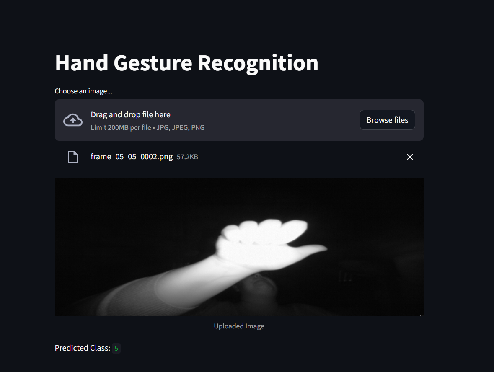

# Task 4 : Hand Gesture Recognition
In this task, we have to recognize the hand gestures using the Convolutional Neural Network.

## Dataset
The dataset contains images of hand gestures performed by 10 different subjects. Each subject has performed 5 different gestures. The images are in the PNG format and have a resolution of 320x240 pixels. The dataset is divided into two parts: training and validation. The training dataset contains 6632 images, while the validation dataset contains 1560 images.

- **/00 (subject with identifier 00)**
    - /01_palm (images for palm gesture of subject 00)
        - frame_197957_r.png, ..., frame_198136_l.png (images corresponding to different samples obtained for the palm gesture performed by subject 00)
    - /02_l (images for l gesture of subject 00)
    - /03_fist
    - /04_fist_moved
    - /05_thumb

- **/01**
- **/02**
- **/09 (last subject with identifier 09)**

## Model
We have used the Convolutional Neural Network (CNN) to recognize the hand gestures. The model is trained on the training dataset and validated on the validation dataset. The model is saved as `hand_gesture_model.h5` or `hand_gesture_model.keras`

## Results
The model achieved an accuracy of 99% on the validation dataset. The model can be used to predict the hand gestures performed by different subjects.

## What I learned
- Image data preprocessing
- Building a Convolutional Neural Network
- Training and validating the model
- use streamlit to create a web app
